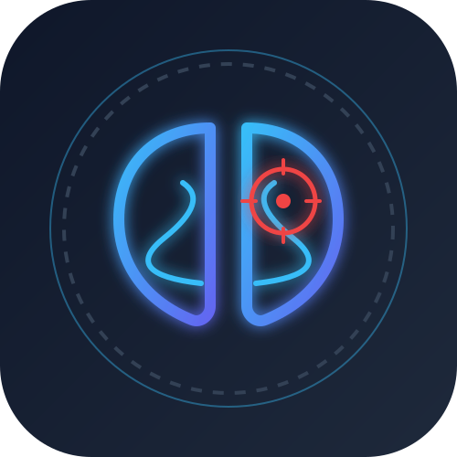
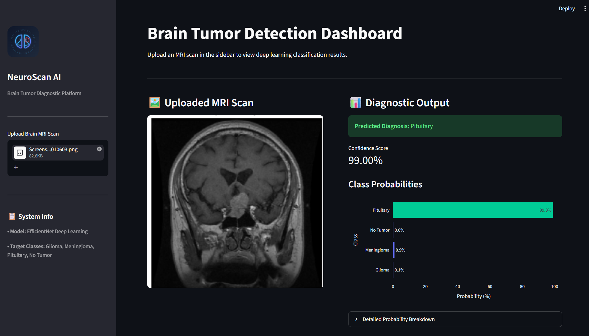

# 🧠 NeuroScan AI — Brain Tumor Detection Dashboard

<p align="center">
  
</p>

<p align="center">
  An interactive deep learning diagnostic dashboard built with <b>Streamlit</b>, <b>TensorFlow/Keras</b>, and <b>Plotly</b> that classifies brain MRI scans into tumor categories using fine-tuned EfficientNet architecture.
</p>

---

## 🖼️ Application Preview



---

## 📌 Features

* 🖼️ **Image Upload:** Supports standard MRI image formats (`.jpg`, `.jpeg`, `.png`).
* 📊 **Interactive Plotly Visualizations:** Displays classification probabilities and confidence breakdown using dynamic charts.
* ⚡ **Real-Time Inference:** Instant predictions powered by a deep neural network backend.
* 💻 **User-Friendly Dashboard:** Side-by-side card interface designed with Streamlit for seamless user experience.

---

## 🛠️ Tech Stack & Dependencies

* **Language:** Python
* **Deep Learning:** TensorFlow, Keras (EfficientNet)
* **Frontend / Dashboard:** Streamlit
* **Data Visualization:** Plotly, Matplotlib
* **Image Processing:** OpenCV, Pillow (PIL)
* **Data Manipulation & ML Tools:** NumPy, Pandas, Scikit-learn
* **Development Environment:** Jupyter Notebooks

---

## 🚀 Getting Started

### Prerequisites
Make sure you have **Python 3.10+** installed on your system.

### 1. Clone the Repository
```bash
git clone [https://github.com/YASH-MV/NeuroScan-AI.git](https://github.com/YASH-MV/NeuroScan-AI.git)
cd NeuroScan-AI
2. Create & Activate a Virtual Environment
Windows (PowerShell):

PowerShell
python -m venv venv
.\venv\Scripts\activate
macOS / Linux:

Bash
python3 -m venv venv
source venv/bin/activate
3. Install Requirements
Bash
pip install -r requirements.txt
🏃 Run the Application
Launch the Streamlit web app:

Bash
streamlit run app.py
Once running, your browser will automatically open at http://localhost:8501.

📁 Project Structure
Plaintext
BRAIN-TUMOR-DETECTION/
├── assets/                      # Application preview screenshots
│   └── app_preview.png
├── dataset/                     # MRI dataset
├── models/                      # Saved trained Keras models
│   ├── best_model.keras
│   └── final_brain_tumor_model.keras
├── notebooks/                   # Jupyter Notebooks for training & analysis
│   ├── prediction.ipynb
│   └── Training.ipynb
├── src/                         # Source code scripts & helper functions
├── app.py                       # Main Streamlit web application
├── gemini-svg.svg               # App logo / icon
├── requirements.txt             # Project dependencies
└── README.md                    # Project documentation
⚠️ Disclaimer
This application is intended strictly for educational and research demonstration purposes. It should not be used as a replacement for clinical diagnosis by qualified medical professionals.
